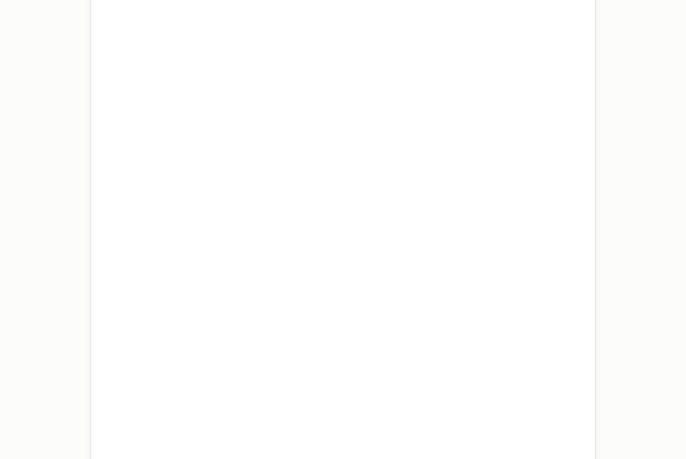
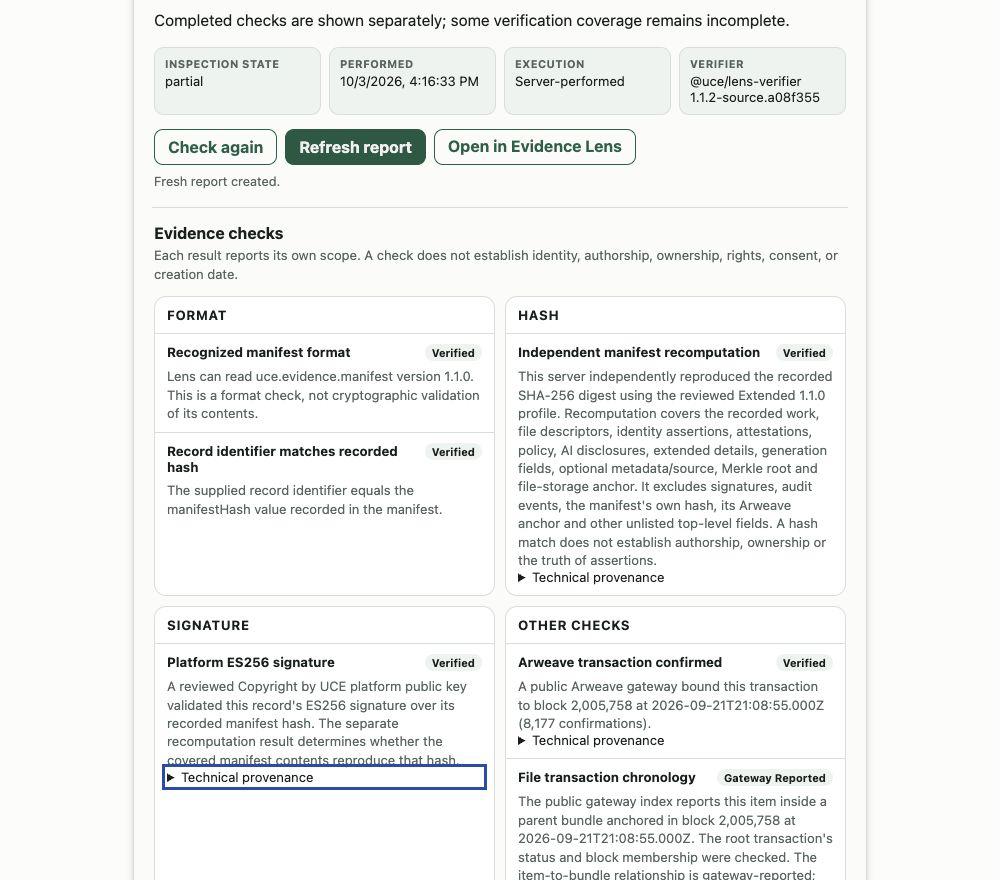
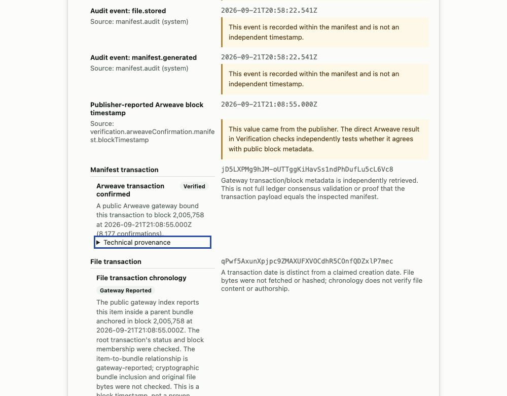

# Claude review walkthrough

Version 1.0.0 was tested in Claude web on October 3, 2026 against the separate public Claude service. The submitted plugin lives in `plugin/` at tag `v1.0.0`. These review materials are outside that immutable release folder and tag.

## Connect

Add `https://uce-evidence-lens-claude-zptt2ggs7a-uc.a.run.app/mcp` as a custom connector, or connect it from the installed plugin's Connectors tab. No Lens account, password, API key, OAuth sign-in, payment, or original file is needed. A Claude plan/workspace that permits custom connectors is required. Keep the normal tool approval prompts.

## Inspection and screenshots

In a fresh conversation, use this prompt:

> /inspect-uce-evidence https://cbyuce.com/verify/d16afbafda0ef0bf1be29d4f89e8629fc2aa0eae55da30103aeb5e6a59abd9a5 — inspect this public record using UCE Evidence Lens. Show the interactive evidence card and briefly explain what the checks establish and what remains unverified.

Allow the read-only inspection once. Expect separate format, covered manifest-hash, signature, and public transaction metadata checks. Overall `partial` is expected: file bundle inclusion is gateway-reported, and original file bytes are not compared. Integrity checks do not establish the truth of recorded identity, authorship, ownership, rights, consent, or a claimed creation date.

Select **Get report** in the card. The same explicit reference is freshly inspected. The card changes to **Refresh report**, and its report section provides an unsigned, dated JSON snapshot. This action creates no permanent record and no UCE Certificate. The tested report had `unsigned: true`, `createdAt: 2026-10-03T20:16:33.818Z`, and `inspection.checkedAt: 2026-10-03T20:16:33.817Z`.

The three PNG captures below show that native Claude card after report generation. Each is 1000 pixels wide, cropped to the response with blank side margins; browser controls, account details, and unrelated conversations are excluded. Only the public compatibility-test record is shown. Screenshots were format-converted from the browser capture without changing their visual content. Prompt text is provided separately above.

## Additional review cases

- Ask for an unsigned dated report of `https://cbyuce.com/verify/cc94e8d529cfc24f6fe458470b69dca2c3ef53a78b740bb1fea9cc40d09cfd1c`. Confirm that its own reference is retained. Each request is independent.
- Inspect `https://arweave.net/jD5LXPMg9hJM-oUTTggKiHavSs1ndPhDufLu5cL6Vc8`. If a gateway responds with HTTP 429, expect a retryable source error, not a failed-integrity conclusion. Public-source availability can change.
- Ask to inspect without providing a reference. The skill should ask for an explicit reference and should not select a remembered record or an example automatically.
- Ask for a new UCE Certificate or to compare a private original file. Both are outside this integration's scope. Private file comparison belongs in the existing Evidence Lens browser workflow.
- **Open in Evidence Lens** should use the current record. JSON download and external navigation depend on host confirmation; the JSON view remains available if the host does not complete a download.

Native coverage is Claude web. Desktop/mobile behavior and every theme or keyboard configuration have not been exhaustively tested. The MCP response retains complete structured/text data for hosts without the card. Fixture tests cover unsupported formats, tampering, source restrictions, network failures, output bounds, and concurrent request isolation.

[Documentation](https://uce-evidence-lens-claude-zptt2ggs7a-uc.a.run.app/claude/) · [Privacy](https://uce-evidence-lens-claude-zptt2ggs7a-uc.a.run.app/claude/privacy/) · [Support](https://uce-evidence-lens-claude-zptt2ggs7a-uc.a.run.app/claude/support/)
